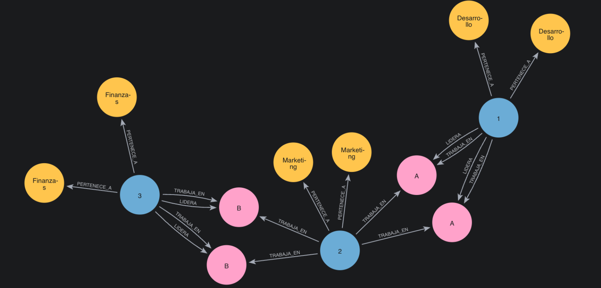

# Trabajo Práctico Neo4j - Ejercicio 1  
## Sistema de Gestión de Proyectos

Este proyecto representa un sistema de gestión de proyectos usando una base de datos de grafos implementada en **Neo4j Desktop 2**.  
Se modelan empleados, departamentos y proyectos, incluyendo relaciones jerárquicas y asignación de horas de trabajo.

---

## 📌 Requisitos del ejercicio

- Cada **Empleado** pertenece a un **Departamento**.
- Los **Proyectos** pueden tener varios empleados asignados con horas semanales.
- Un **Empleado** puede liderar uno o más proyectos.

---

## 📂 Archivos del proyecto

| Archivo              | Descripción                                                  |
|----------------------|--------------------------------------------------------------|
| `modelo.cypher`      | Contiene la creación de nodos y relaciones del grafo.        |
| `consultas.cypher`   | Incluye las consultas requeridas por el ejercicio.           |
| `grafo_ejercicio1.png`| Imagen exportada desde Neo4j con el grafo generado.         |

---

## ⚙️ ¿Cómo ejecutarlo en Neo4j Desktop?

### 1. Crear la instancia y la base de datos
- Abrí Neo4j Desktop.
- Click en **Create Instance** → poné un nombre (ej: `Trabajo Practico 4`).
- Click en **Create Database** → nombrala (ej: `tp4`), y se iniciará automáticamente.

### 2. Conectarse
- Desde el panel izquierdo, entrá a `Query`.
- Seleccioná la instancia y base creada.
- Ingresá la contraseña (si la configuraste).

---

## 🚀 Cargar el modelo

1. Abrí el archivo `modelo.cypher`.
2. Copiá el contenido y pegalo en la pestaña `Query`.
3. Ejecutá para crear los nodos y relaciones.

---

## 🧪 Consultas realizadas

### 1. Obtener el nombre del proyecto, su líder y empleados asignados

```cypher
MATCH (p:Proyecto)<-[:LIDERA]-(l:Empleado)
MATCH (p)<-[:TRABAJA_EN]-(e:Empleado)
RETURN p.nombre AS Proyecto, l.nombre AS Lider, collect(e.nombre) AS Empleados;

```
### 2. Calcular el total de horas semanales por proyecto
```cypher
MATCH (e:Empleado)-[t:TRABAJA_EN]->(p:Proyecto)
RETURN p.nombre AS Proyecto, SUM(t.horas) AS TotalHoras;
```

### 3. Listar los empleados que trabajan en más de un proyecto
```cypher
MATCH (e:Empleado)-[:TRABAJA_EN]->(p:Proyecto)
WITH e, COUNT(DISTINCT p) AS proyectos
WHERE proyectos > 1
RETURN e.nombre AS Empleado, proyectos;
```
🖼️ Grafo generado

Este es el grafo resultante después de ejecutar el modelo:
<div align="center">
  
</div>

### 👨‍💻 Autor
Luciano Kloster
Trabajo realizado para la materia de Bases de Datos 2 - Neo4j
UTN - 2025
