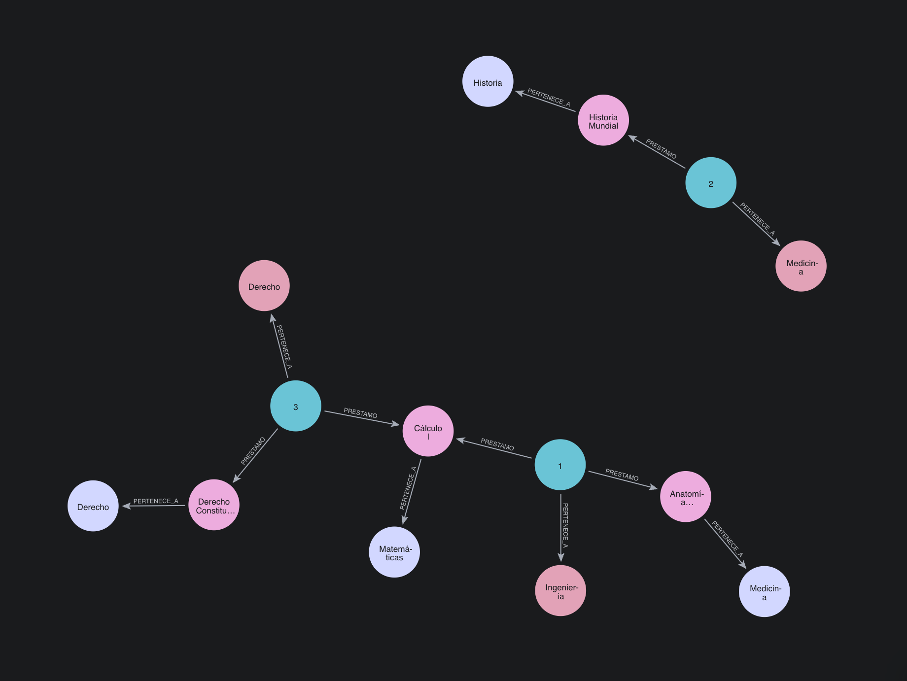

# Trabajo Práctico Neo4j - Ejercicio 2  
## Biblioteca Universitaria Extendida

Este proyecto representa un sistema de préstamos de libros de una biblioteca universitaria modelado como una base de datos de grafos en **Neo4j Desktop 2**.  
Se incluyen entidades como estudiantes, libros, categorías y carreras, y relaciones con propiedades como estado y fecha de préstamo.

---

## 📌 Requisitos del ejercicio

- Los **Estudiantes** piden **Libros** prestados.
- Cada **Libro** pertenece a una **Categoría**.
- Las relaciones de **Préstamo** tienen propiedades:  
  - Fecha  
  - Estado (`"Activo"` o `"Devuelto"`)
- Cada **Estudiante** pertenece a una **Carrera**.

---

## 📂 Archivos del proyecto

| Archivo              | Descripción                                                  |
|----------------------|--------------------------------------------------------------|
| `modelo2.cypher`     | Contiene la creación de nodos y relaciones del grafo.        |
| `consultas2.cypher`  | Incluye las consultas requeridas por el ejercicio.           |
| `grafo2.png`         | Imagen exportada desde Neo4j con el grafo generado.          |

---

## ⚙️ ¿Cómo ejecutarlo en Neo4j Desktop?

### 1. Crear la instancia y la base de datos
- Abrí Neo4j Desktop.
- Click en **Create Instance** → poné un nombre (ej: `Biblioteca TP`).
- Click en **Create Database** → nombrala (ej: `tp_biblioteca`) y se iniciará automáticamente.

### 2. Conectarse
- Desde el panel izquierdo, entrá a `Query`.
- Seleccioná la instancia y base creada.
- Ingresá la contraseña (si la configuraste).

---

## 🚀 Cargar el modelo

1. Abrí el archivo `modelo2.cypher`.
2. Copiá el contenido y pegalo en la pestaña `Query`.
3. Ejecutá para crear los nodos y relaciones.

---

## 🧪 Consultas realizadas

### 1. Obtener todos los libros actualmente prestados (estado "Activo")
```cypher
MATCH (e:Estudiante)-[p:PRESTAMO {estado: 'Activo'}]->(l:Libro)
RETURN l.titulo AS Libro, e.nombre AS Estudiante, p.fecha AS FechaPrestamo;
```

### 2. Listar cuántos libros ha pedido prestado cada estudiante
```cypher
MATCH (e:Estudiante)-[p:PRESTAMO]->(l:Libro)
RETURN e.nombre AS Estudiante, COUNT(p) AS TotalPrestamos;
```

### 3. Mostrar las categorías con más préstamos activos
```cypher
MATCH (e:Estudiante)-[p:PRESTAMO {estado: 'Activo'}]->(l:Libro)-[:PERTENECE_A]->(cat:Categoria)
RETURN cat.nombre AS Categoria, COUNT(p) AS PrestamosActivos
ORDER BY PrestamosActivos DESC;
```

### 4. Encontrar los estudiantes que no tienen préstamos activos
```cypher
MATCH (e:Estudiante)
WHERE NOT (e)-[:PRESTAMO {estado: 'Activo'}]->(:Libro)
RETURN e.nombre AS EstudianteSinPrestamosActivos;
```

🖼️ Grafo generado

Este es el grafo resultante después de ejecutar el modelo:
<div align="center">
  
</div>

🗺️ Visualización del grafo

```cypher
MATCH (n)-[r]->(m) RETURN n, r, m;
```

👨‍💻 Autor
Luciano Kloster